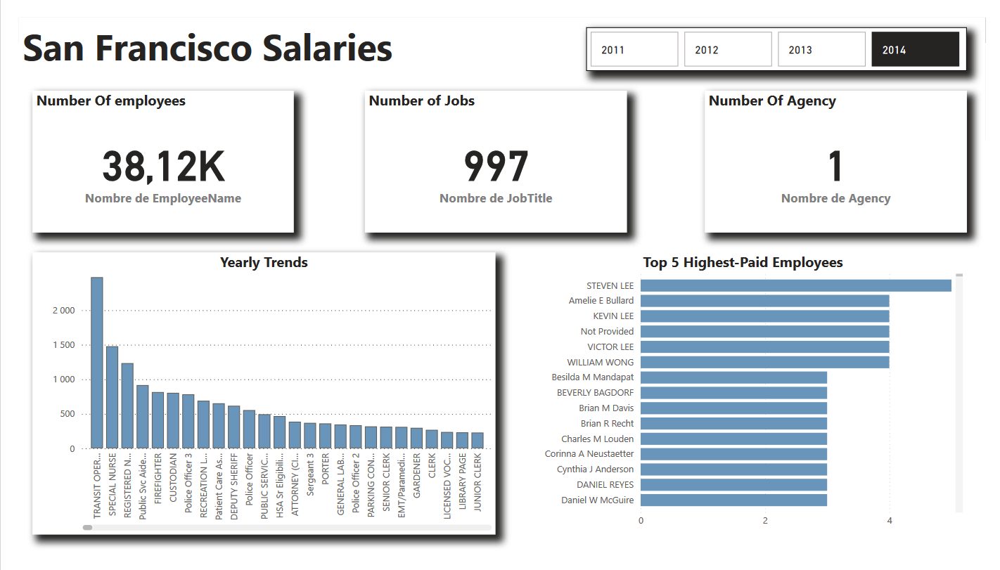

# SF Salaries Analysis 🔍

This repository contains an analysis of the SF Salaries dataset, which includes employee data such as job titles, total pay, and benefits. The goal is to analyze the salary distribution, identify top earners, and explore patterns in the salary structure of employees in San Francisco.

## 📊 Project Overview

This project utilizes **Python** and **Pandas** for data manipulation, along with **Matplotlib** for creating visualizations. Below are some key insights:

- Identify the top 5 highest-paid employees (including benefits).
- Identify the lowest 5 paid employees.
- Visualize salary distribution over multiple years.
- Analyze job titles with the highest and lowest salaries.

## 📂 File Structure

- `Sf Salaries.ipynb`: The Jupyter Notebook that contains the complete analysis and visualizations.
- `README.md`: Description of the project, its features, and conclusions.

## 📈 Visualizations

Key visualizations in the project include:

- **Top 5 Highest-Paid Employees**: A bar chart displaying the employees with the highest total pay, including benefits.
- **Lowest 5 Paid Employees**: A bar chart representing the employees with the lowest total pay.
- **Yearly Trends**: Analysis of salary trends over the years, including visualizations of salary distribution by job title.

## 🔗 View on Kaggle

This project is also available on **Kaggle** for easy access and exploration. You can view, fork, and interact with the notebook on Kaggle.

- [View the Project on Kaggle](https://www.kaggle.com/code/nourhanebndj/sf-salary) 📊

Feel free to explore the notebook, download datasets, and try out the code.

## 📊 Power BI for Visualization

In addition to Python-based analysis, **Power BI** was used to create dynamic and interactive dashboards that allow users to explore the salary data visually. Key features include:

- **KPI and Trends**: Total salary with benefits visualized as KPIs, with trend lines for historical data.
- **Top 5 and Bottom 5 Employees**: Easily explore the highest and lowest earners using interactive bar charts.
- **Salary Breakdown by Job Titles and Year**: Analyze salary distribution across different job titles over time.

If you want to explore the Power BI dashboard, you can access it directly on Power BI Service, or you can download the `.pbix` file to view it locally.

## 🎯 Conclusion

This analysis provides useful insights into the salary distribution in San Francisco, helping to identify key trends and patterns among employees, including which job titles earn the most and the least.

## 👤 Contact

Feel free to reach out for questions or suggestions:

- 📧 **Email**: nourhanebndj@gmail.com
- 🐙 **GitHub**: [Github](https://github.com/nourhanebndj)
